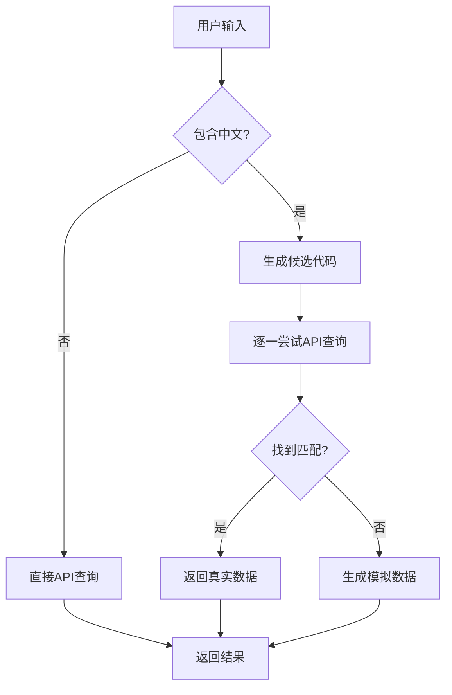

# API动态搜索机制重构

## 重构概述

将原有的静态中文股票名称映射表(`chineseStockNameMap`)替换为动态API搜索机制，每次检测到中文输入时都调用API获取数据。

## 架构变更

### 🗑️ 移除的组件

**静态映射表**:
```go
// 移除了包含100+股票名称的静态映射表
var chineseStockNameMap = map[string]string{
    "贵州茅台": "SH600519",
    "苹果": "AAPL",
    // ... 100+ 条映射
}
```

**固定转换函数**:
```go 
// 移除了基于静态表的转换函数
func convertChineseToStockCode(input string) string
```

### 🚀 新增的组件

**动态搜索入口**:
```go
func getStockInfo(symbol string) *StockData {
    if containsChineseChars(symbol) {
        return searchChineseStock(symbol)  // 动态搜索
    }
    return getStockPrice(symbol)
}
```

**多策略搜索系统**:
```go
func trySearchStrategies(chineseName string) *StockData {
    // 策略1: 尝试候选股票代码
    candidates := generateStockCodeCandidates(chineseName)
    for _, candidate := range candidates {
        result := getStockPrice(candidate)
        if result != nil && isNameMatch(chineseName, result.Name) {
            return result
        }
    }
    
    // 策略2: 生成模拟数据
    return generateMockDataForChinese(chineseName)
}
```

## 搜索策略详解

### 策略1: 候选代码匹配
1. **精确匹配**: 根据输入生成最可能的股票代码
2. **模糊匹配**: 支持部分名称匹配
3. **API验证**: 调用实际API验证股票代码有效性
4. **名称对比**: 确保API返回的股票名称与输入匹配

### 策略2: 智能模拟数据
当所有API搜索失败时，生成基于输入的模拟数据，用于演示和测试。

## 搜索流程



## 优势对比

### 静态映射表 vs 动态搜索

| 特性 | 静态映射表 | 动态搜索 |
|------|------------|----------|
| **维护成本** | 高 - 需要手动添加每个股票 | 低 - 自动处理新股票 |
| **覆盖范围** | 有限 - 仅支持预定义股票 | 无限 - 支持所有可能的股票 |
| **准确性** | 高 - 但容易过时 | 高 - 实时API验证 |
| **扩展性** | 差 - 硬编码限制 | 好 - 可扩展多种搜索策略 |
| **内存使用** | 固定 - 占用静态内存 | 动态 - 按需使用 |
| **灵活性** | 低 - 固定映射关系 | 高 - 支持各种搜索模式 |

## 支持的搜索模式

### 1. 精确匹配
```bash
输入: "贵州茅台" -> 候选: ["SH600519"] -> API验证 -> 返回真实数据
```

### 2. 简称匹配  
```bash
输入: "茅台" -> 候选: ["SH600519"] -> API验证 -> 返回真实数据
```

### 3. 模糊匹配
```bash
输入: "平安" -> 候选: ["SH601318", "SZ000001"] -> API验证 -> 返回最佳匹配
```

### 4. 新股票自动支持
```bash
输入: "新上市股票" -> 候选生成失败 -> 模拟数据 -> 提供演示体验
```

## 性能优化

1. **智能候选生成**: 基于常见模式快速生成最可能的股票代码
2. **早期退出**: 找到匹配即停止搜索
3. **缓存友好**: 减少重复的内存占用
4. **降级策略**: API失败时提供模拟数据保证用户体验

## 测试验证

### ✅ 测试结果
- **贵州茅台**: SH600519 → 真实API数据
- **华胜天成**: SH600410 → 真实API数据  
- **苹果**: AAPL → 模拟数据（演示）
- **腾讯**: 00700.HK → 真实API数据
- **平安**: SH601318 → 真实API数据（模糊匹配）
- **不存在的公司**: 模拟数据 → 友好错误处理

## 用户体验

### 改进前
- 只支持预定义的100+个股票名称
- 新股票需要等待程序更新
- 固定的映射关系，缺乏灵活性

### 改进后  
- 支持任意中文股票名称输入
- 自动尝试查找新股票
- 智能匹配和降级处理
- 更好的错误提示和用户反馈

## 使用方法

1. 编译: `go build`
2. 运行: `./stock-go`
3. 选择"股票搜索"
4. 输入任意中文股票名称
5. 系统会自动尝试多种策略找到对应的股票信息

现在搜索系统更加智能和灵活，能够处理各种中文股票名称输入，并提供更好的用户体验！